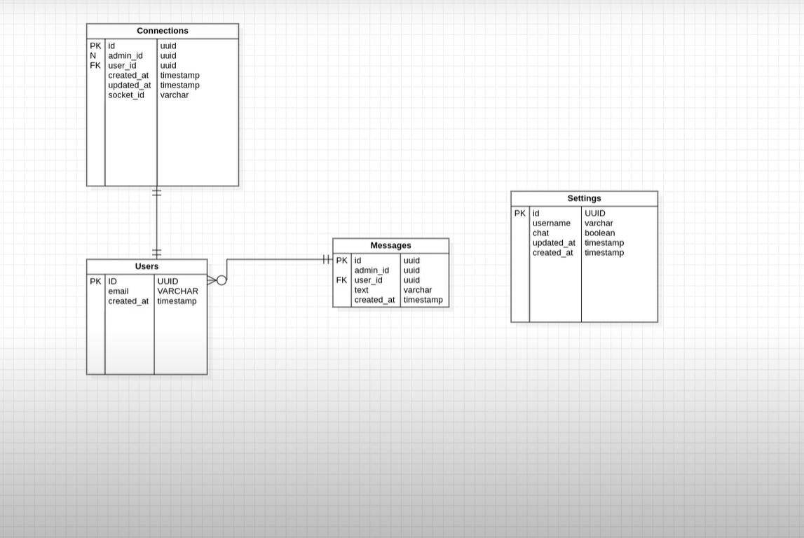

# Chat Node


<h1 align="center">Chat Node</h1>

<p align="center">
  <a href="#-technologies">Technologies</a>&nbsp;&nbsp;&nbsp;|&nbsp;&nbsp;&nbsp;
  <a href="#-project">Project</a>&nbsp;&nbsp;&nbsp;|&nbsp;&nbsp;&nbsp;
  <a href="#-diagram">Diagram</a>&nbsp;&nbsp;&nbsp;|&nbsp;&nbsp;&nbsp;
  <a href="#-getting-started">Getting started</a>&nbsp;&nbsp;&nbsp;|&nbsp;&nbsp;&nbsp;
  <a href="#-licence">Licence</a>
</p>

<br>

## ✨ Technologies

This project was developed using the following technologies:

- [TypeScript](https://www.typescriptlang.org/)
- [TypeORM](https://typeorm.io/#/)
- [Websocket](https://www.npmjs.com/package/websocket)
- [Insomnia](https://insomnia.rest/)
- [SQL Editor Beekeeper Studio](https://www.beekeeperstudio.io/)
- [SQlite](https://www.sqlite.org/index.html)

## 💻 Project

Chat Node is an application that consists of improving the user experience through good communication with the customer via chat.

This project was developed during the NodeJS trail, in the fifth edition of NLW. We learned concepts about what an API is, how to start a project using Typescript and Express for route management, data manipulation, automated tests, among others.

## 🔶 Diagram



## 🚀 Getting started

Clone the project and access the folder

```bash
$ git clone https://github.com/eltonsantos/chat-node.git && cd chat-node
```

Follow the steps below
```bash
# Install the dependencies
$ yarn

# Start the project
$ yarn dev
```

## 📄 Licence

This project is under the MIT license. See the [LICENSE](LICENSE.md) file for more details.

---

## 👨🏻‍💻 Author

<h3 align="center">
  
  <br/>
  <strong>Elton Santos</strong> 🚀
  <br/>
  <br/>

 <a href="https://www.linkedin.com/in/eltonmelosantos" alt="LinkedIn" target="blank">
    
  </a>

  <a href="mailto:elton.melo.santos@gmail.com?subject=Olá%20Elton" alt="Email" target="blank">
    
  </a>

<br/>

Made with ❤️ by Elton Santos 👋🏽 [Entre em contato!](https://www.linkedin.com/in/eltonmelosantos/)

</h3>
